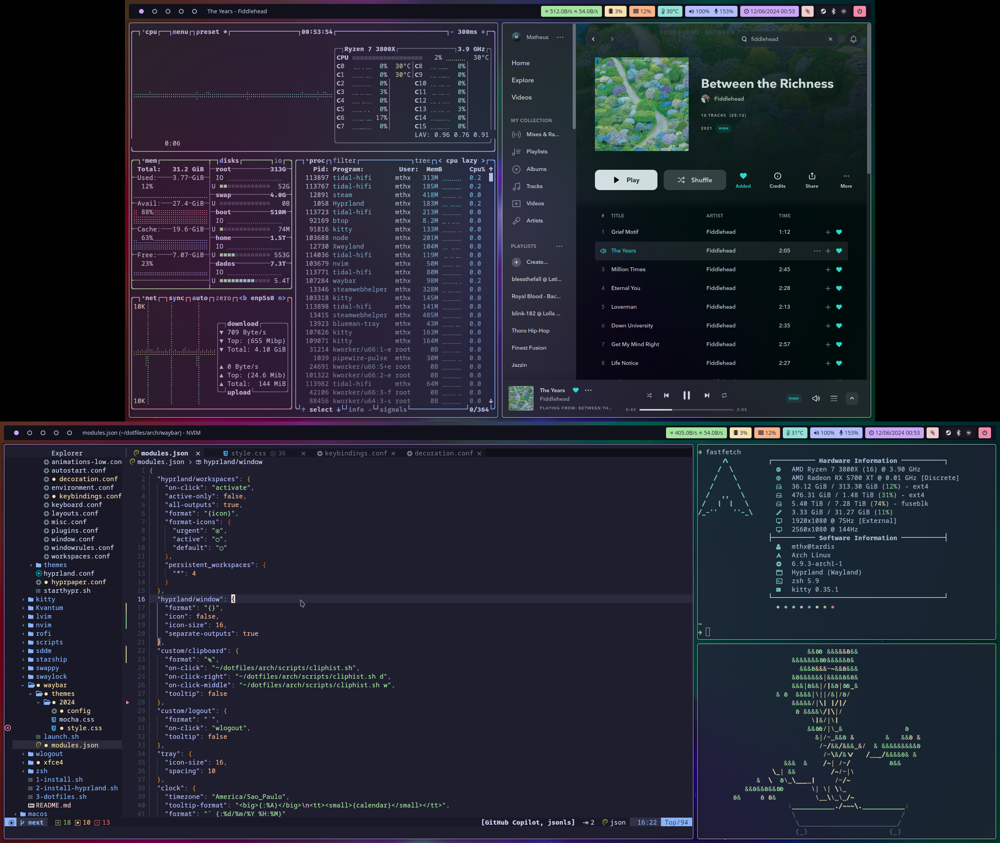

# Arch Linux Dotfiles



## Main Packages

- **Window manager**: Hyprland
- **Terminal**: Kitty
- **Editors**: Neovim (feat. LunarVim), Visual Studio Code and Sublime Text
- **Shell**: zsh
- **Prompt**: Starship
- **Glyphs**: Font Awesome
- **Menus**: Rofi
- **Color scheme**: Catppuccin Mocha
- **Browser**: Firefox
- **File manager**: Thunar
- **Cursor**: Dracula
- **Icons**: Kora
- **Status Bar**: Waybar
- **Screenshots**: grim & slurp
- **Clipboard Manager**: cliphist
- **Notifications**: dunst
- **Session Manager**: SDDM
- **Logout**: wlogout
- **Screenlock**: hyprlock
- **Wallpaper engine**: hyprpaper

## Getting started

> Make sure to backup your existing `~/.config` folder before running the following commands.

```sh
# Make sure that you're in your home directory
cd

# Clone the repository from your home directory
git clone https://github.com/mathcale/dotfiles.git

# Change into the new dotfiles folder
cd dotfiles/arch

# Install all required packages
./1-install.sh

# Install dotfiles with symbolic links
./2-dotfiles.sh
```

## Credits

Inspired on Stephan Raabe's [dotfiles](https://gitlab.com/stephan-raabe/dotfiles)
